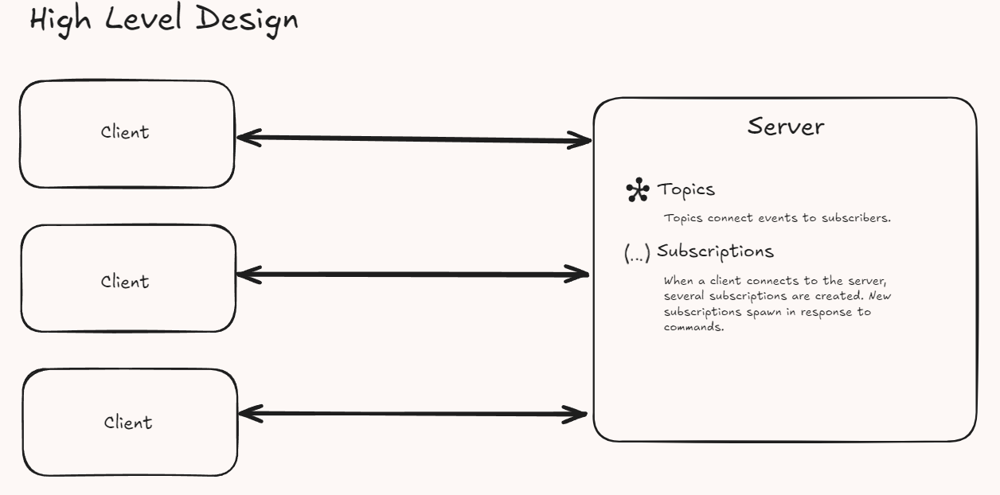
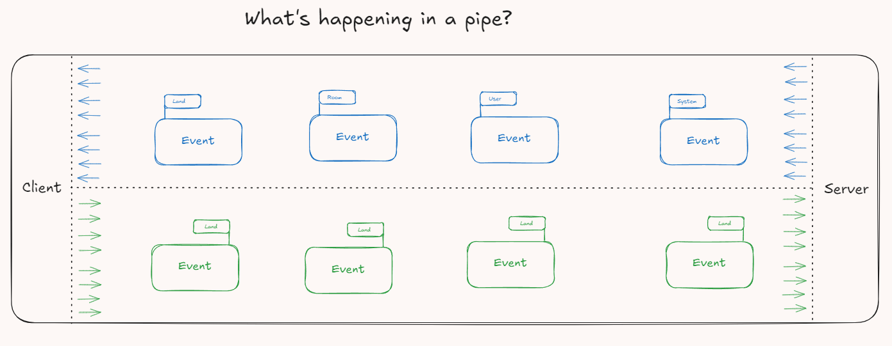
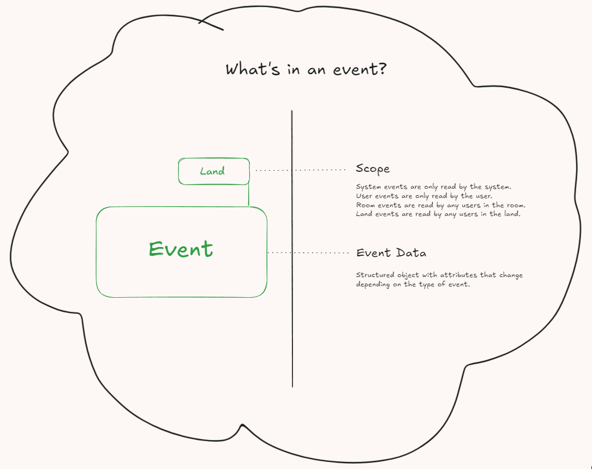

# Wonderland

> Text-based persistent world with websockets and Carroll.

## Architecture Diagrams

These visualizations are very simplistic, but my goal at this phase in the project is
to visualize my planned architecture and catch any potential issues early.

## List of Bugs

> Who needs a list of features when you have a big 'ol list of problems?

- The current system does not support multi-step commands.
  - For example, requesting username during login. Any input provided by the user will attempt to be matched to a command.
  - My naive first thought at resolving this is to create context windows which commands are limited during the window.
